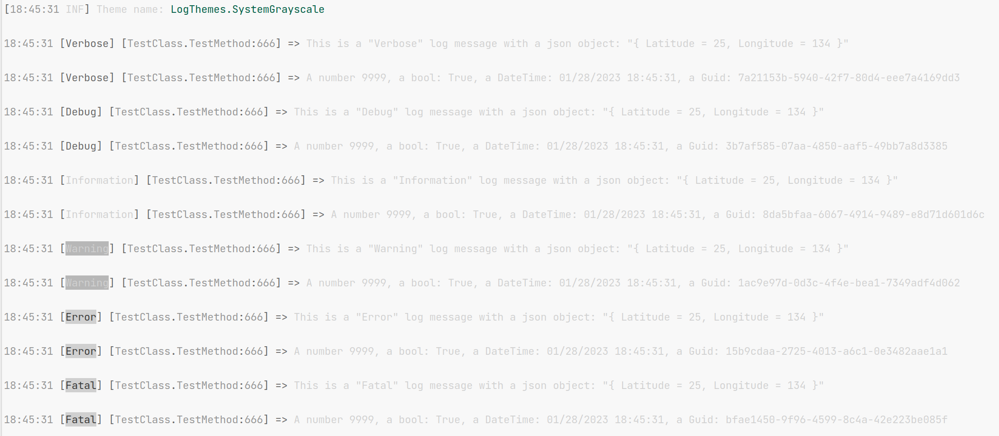
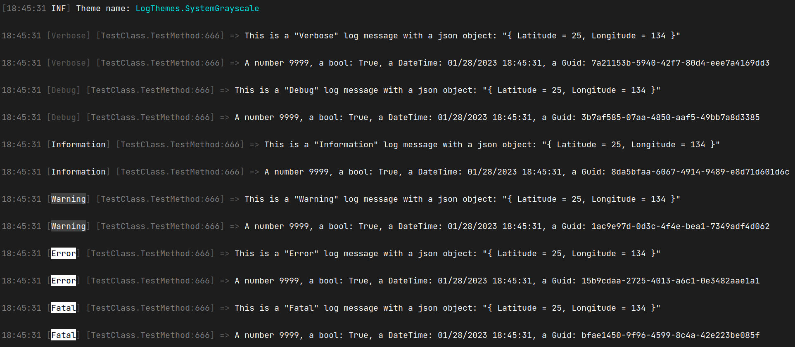

# Serilog.Sinks.Console.LogThemes

An extension on the great [Serilog Sinks Console](https://github.com/serilog/serilog-sinks-console) which provides the extra features:

 - More themes, including the ones from the Serilog Sinks Console

Make sure to run the demo unit test in debug mode otherwise the colors might not show up

# Themes

`LogThemes.`

The following built-in themes are available:

Note: All images are screenshots from Jetbrains Rider with Rider Light theme and Visual Studio Dark Plus theme for the dark-mode
### * `LogThemes.None` - no styling

###  - `LogThemes..Literate` - styled to replicate _Serilog.Sinks.Literate_, using the `System.Console` coloring modes supported on all Windows/.NET targets; **this is the default when no theme is specified**

###  - `LogThemes.SystemGrayscale` - a theme using only shades of gray, white, and black
Light-mode:

Dark-mode:

###  - `LogThemes.Literate` - an ANSI 256-color version of the "literate" theme
###  - `LogThemes.Grayscale` - an ANSI 256-color version of the "grayscale" theme
###  - `LogThemes.Code` - an ANSI 256-color Visual Studio Code-inspired theme
###  - `LogThemes.Sixteen` - an ANSI 16-color theme that works well with both light and dark backgrounds
